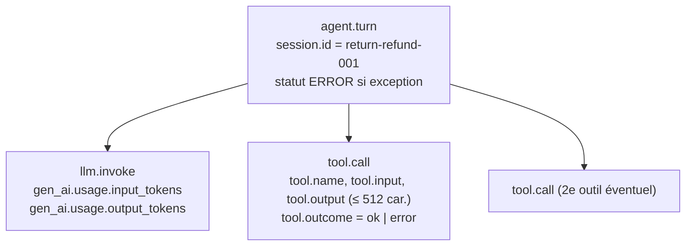

# Mardik : tests de rejeu, observabilité et incidents récurrents

> Document de synthèse qui répond aux cinq livrables du brief Mardik.
> Chaque affirmation renvoie à un fichier du dépôt ou à un commit.
> État de référence : commit `69ab3ea`, suite complète **75 tests verts** (`uv run pytest`, ~1 s).

| # | Livrable du brief | Où c'est fait | Section |
|---|---|---|---|
| 1 | Écrire des tests d'intégration rejouant des sessions réelles | `sessions/*.json`, `src/mardik/runner.py`, `tests/integration/` | [1](#1-tests-dintégration-rejouant-des-sessions-réelles) |
| 2 | Instrumenter l'application (traces, métriques, logs structurés) | `src/mardik/telemetry.py`, `src/mardik/agent.py` | [2](#2-instrumentation--traces-métriques-logs-structurés) |
| 3 | Diagnostiquer et corriger au moins deux incidents récurrents | PR #2 (`9287eaa`), puis `67a0726`, `a406520` et PR #5 (`c6cac38`) | [3](#3-diagnostic-et-correction-des-incidents-récurrents) |
| 4 | Vérifier que les tests d'intégration détectent désormais ces incidents | Test de mutation : on remet chaque bug et la suite échoue | [4](#4-preuve--les-tests-détectent-les-incidents) |
| 5 | Documenter causes et correctifs | Ce document, les messages de commit, le `README.md` | [5](#5-fiches-incident--causes-et-correctifs) |

---

## 1. Tests d'intégration rejouant des sessions réelles

### 1.1 Principe

Une **session enregistrée** est un fichier JSON issu d'une vraie conversation client. Il contient un `session_id`, la liste des `messages` qui alternent `user` et `assistant`, et parfois un bloc `expected` qui décrit le résultat attendu.

Le rejeu (`src/mardik/runner.py`) fait trois choses :

1. Il charge **tout l'historique sauf le dernier message** dans le `SessionStore` (`store.load_history`).
2. Il joue le **dernier message utilisateur** comme un nouveau tour, avec `agent.run_turn`.
3. Il renvoie le `TurnResult` de ce tour.

```python
def replay(session_data, agent, store) -> TurnResult:
    session_id = session_data["session_id"]
    *previous, last = session_data["messages"]
    store.load_history(session_id, previous)
    return agent.run_turn(store, session_id, last["content"])
```

Le test traverse donc **toute la pile réelle** : runner → store → LLM → outils → télémétrie. Seul le LLM est remplacé par un double scripté et déterministe (`tests/conftest.py`). Les outils, le store et la télémétrie sont les vrais composants ; la télémétrie est branchée sur des exporteurs **en mémoire** (`InMemorySpanExporter`, `InMemoryMetricReader`).

> **Pourquoi un faux LLM ?** Un test d'intégration doit être rejouable à l'identique en CI, sans clé Azure, sans coût et sans aléa. Le faux LLM ne simule pas l'intelligence du modèle, seulement sa *forme de réponse* (texte + `tool_calls`). On vérifie ainsi le **comportement du système autour du modèle**. La qualité sémantique des réponses reste hors périmètre (voir le README, *Known issues*).

### 1.2 Sessions enregistrées

| Fichier | Ce que la session met à l'épreuve |
|---|---|
| `sessions/replay_delivery.json` | La commande #1042 n'apparaît qu'au 1er tour ; la question finale (« Où en est sa livraison ? ») n'y fait plus référence. Il faut donc de la **mémoire de session**. |
| `sessions/return_refund.json` | 7 messages, la commande #3157 citée tout au début. On vérifie le contexte long et l'absence de fuite entre sessions. |
| `sessions/size_exchange.json` | **Deux outils dans un même tour** (`lookup_order` + `knowledge_base`). C'est la session de l'incident 1. |
| `sessions/incident_timeout.json` | Session réelle pendant laquelle le LLM a expiré. C'est la session de l'incident 2. |

Un test de contrat (`test_recorded_session_is_well_formed`) vérifie chaque enregistrement : `session_id` non vide, rôles alternés, dernier message `user`. Un autre (`test_recorded_session_ids_are_unique`) vérifie que les identifiants sont uniques. Un enregistrement mal formé casse la CI au lieu de fausser silencieusement un rejeu.

### 1.3 Suites de rejeu

| Fichier | Couverture |
|---|---|
| `tests/integration/test_replay.py` | Fumée : le contexte est préservé, l'incident timeout lève `LLMTimeoutError` et garde l'historique intact. |
| `tests/integration/test_replay_return_refund.py` | Historique complet transmis au LLM dans l'ordre, store = historique + nouvel échange, pas de fuite entre sessions, tour de suivi, trace bien imbriquée, métrique sans `session_id`, log `turn.completed`. |
| `tests/integration/test_replay_size_exchange.py` | Outils appelés dans l'ordre avec les arguments tirés de l'historique, réponse combinée statut + procédure, variantes paramétrées sur 4 numéros de commande, demande sans numéro puis résolue au tour suivant. |
| `tests/integration/test_replay_incidents.py` | **Tests de non-régression** des incidents 1 et 2 (section 3). |
| `tests/integration/test_replay_concurrent_session.py` | 24 tours **simultanés sur la même session** (double-clic, deux onglets). C'est l'incident 3. |
| `tests/integration/test_observability.py` | Lecture croisée des trois signaux sur des rejeux, y compris **24 tours concurrents** et une charge mixte succès / timeout / outil inconnu. |

Pour lancer les tests :

```bash
make test                                   # toute la suite (unitaires + intégration)
uv run pytest tests/integration -v          # uniquement les rejeux
uv run pytest tests/integration/test_replay_incidents.py -v
```

La CI (`.github/workflows/ci.yml`) exécute `ruff format --check`, `ruff check`, `mypy src` puis `pytest -v` sur **toute** la suite. Avant la PR #2, elle ne lançait que `tests/unit`, donc les rejeux ne protégeaient pas `main`.

---

## 2. Instrumentation : traces, métriques, logs structurés

Toute l'observabilité passe par un objet **injectable**, `Telemetry` (`src/mardik/telemetry.py`). L'agent le reçoit par son constructeur. Il ne crée jamais lui-même d'exporteur ni de provider global :

- en **production**, `build_default_telemetry(settings)` configure OTLP/gRPC vers le collecteur (Jaeger via `docker-compose.yml`) avec un `BatchSpanProcessor` ;
- en **test**, `build_telemetry(span_exporter=InMemorySpanExporter(), metric_reader=InMemoryMetricReader())` permet d'inspecter ce qui a été émis ;
- sans télémétrie branchée, `NoOpTelemetry` garde un agent fonctionnel qui n'émet rien.

Chaque span et chaque métrique porte la même identité de service (`service.name`, `service.version`, via `build_resource`).

### 2.1 Traces (OpenTelemetry)



Quelques points d'implémentation (`src/mardik/agent.py`) :

- **Propagation de contexte entre threads.** L'appel Azure est bloquant et tourne donc sur un thread de travail. Il est exécuté via `contextvars.copy_context().run(...)`, sinon le span `llm.invoke` démarrerait une trace orpheline. Le test `test_concurrent_turns_each_get_an_isolated_well_formed_trace` vérifie, avec 24 tours forcés à se chevaucher par une `threading.Barrier`, que chaque trace contient exactement `agent.turn` > `llm.invoke` + `tool.call`.
- **Charges utiles tronquées.** `tool.input` et `tool.output` sont limités à 512 caractères (`MAX_SPAN_PAYLOAD_CHARS`) pour qu'un gros résultat n'alourdisse pas la trace. Le client reçoit toujours la réponse entière (`test_large_tool_output_is_truncated_on_the_span`).
- **Erreurs.** Une exception qui traverse un span le passe en statut `ERROR` et y ajoute un événement `exception` (`exception.type`).

### 2.2 Métriques

| Instrument | Type | Attributs | Usage |
|---|---|---|---|
| `latency_ms` | Histogramme (ms) | `outcome` = `ok` \| `error` | Latence p50/p95 par issue |
| `errors_total` | Compteur | `error.type` (ex. `LLMTimeoutError`, `KeyError`) | Taux d'erreur par cause |
| `tool_calls_total` | Compteur | `tool.name`, `outcome` | Taux de succès par outil |

> **Règle de cardinalité.** `session_id` n'est **jamais** un attribut de métrique, sinon chaque session crée sa propre série temporelle. Il reste sur les spans et dans les logs. `test_metrics_aggregate_a_mixed_load_without_session_labels` fait respecter cette règle.

Les mesures de tour sont centralisées dans `Telemetry.track_turn(session_id)`, un context manager qui mesure la latence, incrémente `errors_total` et écrit le log. Il **relance toujours** l'exception : il observe sans jamais l'avaler.

### 2.3 Logs structurés (structlog, JSON)

Un tour produit exactement une ligne JSON sur stdout :

```json
{"session_id": "incident-timeout-001", "latency_ms": 0.1, "error_type": "LLMTimeoutError",
 "event": "turn.failed", "level": "error", "timestamp": "2026-09-14T16:51:21.436602Z",
 "trace_id": "c7e3984253d5ff93212a23630e3aaf8e", "span_id": "e815945c40a6a0de"}
```

- Événements : `turn.completed` (niveau `info`) et `turn.failed` (niveau `error`, avec `error_type`).
- Le processeur `add_trace_context` ajoute `trace_id` et `span_id` du span actif. **Pour passer d'un log à sa trace**, on copie le `trace_id` dans la recherche Jaeger. Dans l'autre sens, `grep <trace_id>` dans les logs.
- `test_json_log_line_joins_the_turn_trace` et `test_concurrent_turn_logs_point_to_their_own_trace` analysent les **vraies lignes écrites sur stdout** (et non un logger mocké). Ils vérifient que chaque log pointe vers *sa* trace, même avec 24 tours concurrents.

### 2.4 Un incident vu à travers les trois signaux

`test_llm_timeout_incident_is_observable_on_every_signal` rejoue `incident_timeout` et vérifie ce que verrait un opérateur :

| Signal | Ce qu'on observe |
|---|---|
| Trace | `agent.turn` en ERROR > `llm.invoke` en ERROR, événement `exception.type = TimeoutError`, **aucun** `tool.call` |
| Métriques | `errors_total{error.type="LLMTimeoutError"} = 1`, `latency_ms{outcome="error"}` compte 1 |
| Log | `turn.failed`, `error_type = LLMTimeoutError`, `trace_id` identique à celui du span `agent.turn` |

---

## 3. Diagnostic et correction des incidents récurrents

Méthode suivie pour chaque incident : **(1)** rejouer la session réelle qui déclenche le problème, **(2)** écrire le test qui échoue sur le code d'origine, **(3)** lire traces, métriques et état du store pour isoler la cause, **(4)** corriger au plus petit périmètre, **(5)** garder le test comme non-régression.

Les deux incidents demandés par le brief sont les **incidents 1 et 2** (PR #2, commit `9287eaa`). Deux autres défauts récurrents, découverts en cours de route et traités de la même façon, sont documentés en 3 et 4.

### Incident 1 : réponses partielles quand un tour appelle plusieurs outils

**Symptôme.** Pendant un échange de taille (`size_exchange`), le client ne recevait que le lien vers le centre d'aide. Le **statut de la commande disparaissait** alors que la trace montrait bien deux spans `tool.call`, tous deux `outcome=ok`.

**Diagnostic.** Les traces montraient que les deux outils avaient réussi, mais la réponse n'en reflétait qu'un. Le défaut se trouvait donc entre le dispatch des outils et la construction de la réponse. Code d'origine dans `Agent.run_turn` :

```python
text = reply.content
for call in reply.tool_calls:
    text = self._dispatch_tool(call)   # écrase à chaque itération
```

**Cause racine.** Une **affectation au lieu d'une accumulation** : chaque sortie d'outil écrasait la précédente, seule la dernière survivait. Le texte du LLM était lui aussi écrasé dès le premier outil. Le bug passait inaperçu parce que toutes les sessions testées jusque-là n'appelaient qu'un seul outil.

**Correctif** (`src/mardik/agent.py`) :

```python
# Keep every tool output: overwriting dropped all but the last one.
parts = [reply.content] if reply.content else []
parts.extend(self._dispatch_tool(call) for call in reply.tool_calls)
text = "\n".join(parts)
```

Le texte du LLM vient en premier, puis chaque sortie d'outil **dans l'ordre d'appel**. La réponse complète est stockée et renvoyée au LLM au tour suivant.

### Incident 2 : mémoire de session corrompue après un timeout du LLM

**Symptôme.** Après un timeout (`incident_timeout`), le client réessaie. L'historique contenait alors **deux fois la même question** (`user, user, assistant`), le compteur affichait `turns = 2` pour un seul échange réussi, et le LLM recevait un prompt avec la question en double.

**Diagnostic.** La trace du premier tour montrait `agent.turn` en ERROR et le log `turn.failed`, et pourtant l'état du store avait changé. En rejouant « timeout puis retry » et en inspectant `store.history()`, on a trouvé l'ordre des opérations d'origine :

```python
store.append(session_id, {"role": "user", "content": user_message})  # écrit AVANT
store.record_turn(session_id)                                        # compté AVANT
reply = self._invoke_llm(store.history(session_id))                  # peut lever
...
store.append(session_id, {"role": "assistant", "content": text})
```

**Cause racine.** Le **tour n'était pas atomique** : des effets de bord (écriture du message, incrément du compteur) avaient lieu avant l'étape qui peut échouer. Un tour en échec laissait un message utilisateur orphelin que le retry dupliquait.

**Correctif** (`src/mardik/agent.py` + `src/mardik/session.py`) : rien n'est écrit tant que le tour n'a pas réussi.

```python
user_entry = {"role": "user", "content": user_message}
# Le prompt est construit sans toucher au store
reply = self._invoke_llm([*store.history(session_id), user_entry])
...
store.commit_turn(session_id, user_entry, {"role": "assistant", "content": text})
```

```python
def commit_turn(self, session_id, user_message, assistant_message) -> None:
    """Persist a completed turn: both messages are appended together, then counted."""
    with self._lock:
        self._history.setdefault(session_id, []).extend([user_message, assistant_message])
        count = self._turns.get(session_id, 0)
        time.sleep(0.0005)
        self._turns[session_id] = count + 1
```

La paire user/assistant et le comptage sont persistés **ensemble, sous verrou, une seule fois**. L'ancienne méthode `record_turn` a été supprimée (PR #5).

### Incident 3 (complémentaire) : tours perdus sous concurrence sur une même session

**Symptôme.** Quand plusieurs tours arrivaient en même temps pour une même session (double envoi, deux onglets), le compteur `turns` restait **inférieur** au nombre de tours réellement servis.

**Cause racine.** Le compteur était mis à jour en **lecture-puis-écriture non atomique** (`count = get(); sleep(); set(count + 1)`). Deux threads lisaient la même valeur et un incrément se perdait. Une *race condition* classique.

**Correctif.** Commit `67a0726` : verrou `threading.Lock` autour de la lecture-écriture. Il a été conservé dans `commit_turn` (voir plus haut).

**Angle mort découvert ensuite (PR #5).** Les tests de charge de `test_observability.py` donnaient à chaque tour **sa propre** session, et le test unitaire visait `record_turn`, que l'agent n'appelait plus. On pouvait donc **retirer le verrou sans qu'aucun test n'échoue**. `test_replay_concurrent_session.py` comble ce trou : 24 tours simultanés sur `return-refund-001`.

### Incident 4 (complémentaire) : un LLM qui ne répond pas bloque le tour indéfiniment

**Symptôme.** Un appel Azure qui ne répond jamais laissait le tour suspendu, sans erreur, sans log et sans span terminé : **invisible** dans l'observabilité.

**Causes racines successives.**

1. Commit `a406520` : le thread de travail **avalait** le `TimeoutError` (`return None`) et, de toute façon, une exception ne traverse pas une frontière de thread. Correctif : l'exception est transmise et relevée sous forme de `LLMTimeoutError` (exception de domaine, `src/mardik/errors.py`), chaînée à la cause d'origine.
2. PR #5 (`c6cac38`) : `future.result()` n'avait **pas de délai** et le context manager de l'exécuteur attendait la fin du thread à la sortie. Correctif : `future.result(timeout=self.llm_timeout_s)` (configurable via `MARDIK_LLM_TIMEOUT_S`, 30 s par défaut) et `pool.shutdown(wait=not hung, cancel_futures=hung)`, qui abandonne le thread bloqué au lieu de l'attendre.

---

## 4. Preuve : les tests détectent les incidents

Qu'un test passe **après** le correctif ne prouve rien s'il passait aussi **avant**. Nous avons donc fait un **test de mutation manuel** : sur une copie du code, **chaque bug d'origine a été réintroduit isolément**, puis toute la suite a été relancée (`pytest`, 75 tests).

| Mutation réintroduite | Résultat | Tests d'intégration qui la détectent |
|---|---|---|
| **I1** : `text = self._dispatch_tool(call)` (écrasement) | **5 échecs** / 75 | `test_replay_incidents.py` : `test_multi_tool_replay_returns_every_tool_output_in_call_order`, `test_multi_tool_replay_keeps_llm_text_before_tool_outputs`, `test_multi_tool_reply_is_stored_whole_and_fed_to_the_next_turn` · `test_replay_size_exchange.py` : `test_reply_combines_order_status_and_exchange_procedure`, `test_exchange_request_without_order_id_asks_for_it_then_resolves` |
| **I2** : message user + compteur écrits **avant** l'appel LLM | **10 échecs** / 75 | `test_replay_incidents.py` : `test_timeout_incident_retry_yields_clean_history`, `…_retry_sends_the_question_to_the_llm_once`, `test_repeated_timeouts_never_grow_the_session`, `test_timeout_incident_does_not_leak_into_other_sessions`, `test_hanging_llm_is_cut_off_by_the_deadline` · `test_replay.py::test_replay_timeout_incident_keeps_recorded_history` · `test_observability.py::test_failing_tool_call_is_observable_on_every_signal` · `test_replay_concurrent_session.py` ¹ · unitaires `test_agent_errors.py` (×2) |
| **I3** : verrou retiré de `commit_turn` | **2 échecs** / 75 | `test_replay_concurrent_session.py::test_concurrent_turns_on_one_session_are_all_counted_and_stored` · unitaire `test_session.py::test_commit_turn_counts_every_concurrent_turn` |
| **I4** : `future.result()` sans délai | **1 échec** / 75 | `test_replay_incidents.py::test_hanging_llm_is_cut_off_by_the_deadline` (le `HangingLLM` rend la main après 2 s : une régression **fait échouer** le test au lieu de bloquer la CI) |
| Code actuel (aucune mutation) | **75 réussites** | — |

¹ La mutation I2 réintroduit aussi un compteur non verrouillé, d'où cet échec supplémentaire.

**Conclusion.** Chaque incident est détecté par **au moins un test d'intégration qui rejoue une session enregistrée**, pas seulement par des tests unitaires. Le message de la PR #2 le constatait déjà sur le code non corrigé : *« 7 of the 11 tests fail against main's unfixed source »*.

Pour reproduire une mutation (exemple avec I4, sur une copie jetable) :

```bash
cp -R . /tmp/mardik-mut && cd /tmp/mardik-mut
sed -i '' 's/future.result(timeout=self.llm_timeout_s)/future.result()/' src/mardik/agent.py
uv run pytest -q     # attendu : 1 failed, 74 passed
```

---

## 5. Fiches incident : causes et correctifs

| | Incident 1 : réponses partielles | Incident 2 : mémoire corrompue après timeout | Incident 3 : tours perdus en concurrence | Incident 4 : tour bloqué par un LLM muet |
|---|---|---|---|---|
| **Session de rejeu** | `size_exchange` | `incident_timeout` | `return_refund` × 24 tours simultanés | `incident_timeout` + `HangingLLM` |
| **Impact client** | Statut de commande absent de la réponse | Question dupliquée dans le contexte, compteur faux | Comptabilité des tours erronée | Conversation figée, aucune erreur |
| **Signal révélateur** | 2 spans `tool.call` `ok` mais une seule sortie dans la réponse | `agent.turn` ERROR + `turn.failed`, mais le store a changé | `turns` < nombre de spans `agent.turn` et de `latency_ms{ok}` | Aucun span terminé, aucun log : un trou dans les signaux |
| **Cause racine** | Affectation au lieu d'accumulation dans la boucle d'outils | Effets de bord **avant** l'étape faillible : tour non atomique | Lecture-puis-écriture non atomique du compteur | Exception avalée dans le thread, puis `future.result()` sans délai |
| **Correctif** | `parts` accumulé et joint par `\n`, texte LLM en tête | Prompt construit sans écrire ; `SessionStore.commit_turn` atomique en fin de tour | `threading.Lock` dans `commit_turn` | `LLMTimeoutError` + `future.result(timeout=…)` + abandon du thread bloqué |
| **Commits** | `9287eaa` (PR #2), `25b6375` (PR #3) | `9287eaa` (PR #2), `25b6375` (PR #3) | `67a0726`, `c6cac38` (PR #5) | `a406520`, `c6cac38` (PR #5) |
| **Non-régression** | `test_replay_incidents.py` (4 tests incident 1) | `test_replay_incidents.py` (7 tests incident 2) | `test_replay_concurrent_session.py` | `test_hanging_llm_is_cut_off_by_the_deadline` |

### Enseignements

1. **Le bug vit là où les sessions de test ne vont pas.** L'incident 1 est apparu avec la première session à deux outils, l'incident 3 avec le premier test concurrent *sur une même session*. Chaque forme de conversation réelle nouvelle mérite son enregistrement.
2. **Un tour doit être atomique.** On n'écrit rien avant l'étape qui peut échouer, et on écrit tout d'un coup à la fin.
3. **L'observabilité doit couvrir aussi les échecs.** Grâce à `track_turn` et au statut ERROR des spans, un tour en échec produit un span, un compteur et un log liés par `trace_id`. L'incident 4 montre qu'un tour qui *ne se termine jamais* reste invisible tant qu'on ne lui impose pas de délai.
4. **Un test qui ne voit pas la mutation est un faux filet.** Retirer le verrou de l'incident 3 laissait la suite verte jusqu'à la PR #5. Réinjecter le bug est le seul moyen de prouver qu'un test protège vraiment.
5. **Une fusion peut défaire un correctif.** Le squash-merge de la PR #2 sur la PR #1 avait perdu l'instrumentation de `run_turn` (`25b6375`, PR #3). C'est la suite complète en CI, et non le seul `tests/unit`, qui l'a révélé.

### Limites connues (cf. `README.md`)

- `llm.py` renvoie le modèle LangChain brut (`AIMessage`) et non le `Reply` attendu par `Agent`. Un adaptateur (contenu, `tool_calls`, `usage_metadata` → `usage`) reste à écrire avant la production.
- Aucune évaluation de la **qualité** des réponses (LLM-as-judge, groundedness) : les rejeux vérifient le comportement et les signaux, pas la pertinence sémantique.
